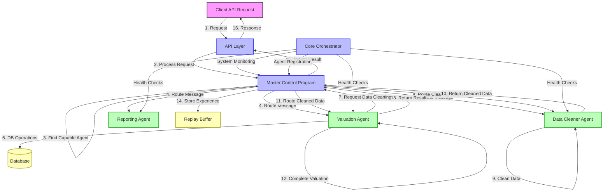

# Agent System Interaction Diagram

The following diagram illustrates how the components of the Multi-Agent System interact with each other:

## Message Flow Sequence

1. Client sends a request to the API layer (e.g., property valuation)
2. API layer processes request and forwards to MCP
3. MCP identifies which agent has the required capability
4. MCP routes the message to the appropriate agent (e.g., Valuation Agent)
5. Valuation Agent processes the request
6. If needed, Valuation Agent performs database operations
7. Valuation Agent may need data cleaning and sends a request
8. MCP routes the cleaning request to the Data Cleaner Agent
9. Data Cleaner Agent processes and cleans the data
10. Data Cleaner Agent returns the cleaned data to MCP
11. MCP routes the cleaned data back to the Valuation Agent
12. Valuation Agent completes the valuation with cleaned data
13. Valuation Agent returns the result to MCP
14. MCP stores the interaction experience in the Replay Buffer
15. MCP returns the final result to the API layer
16. API layer formats and sends the response to the Client

Throughout this process, the Core Orchestrator monitors the system, handles agent registration, and performs health checks to ensure everything is functioning properly.

## Event-Based Communication

In addition to the request-response pattern shown above, the system also uses event-based communication:

- Agents can broadcast messages to all other agents
- Status updates are sent regularly to maintain system awareness
- Error events trigger appropriate handling and recovery mechanisms
- Training events prompt agents to learn from the Replay Buffer